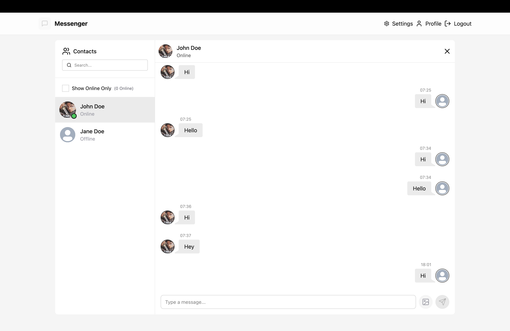
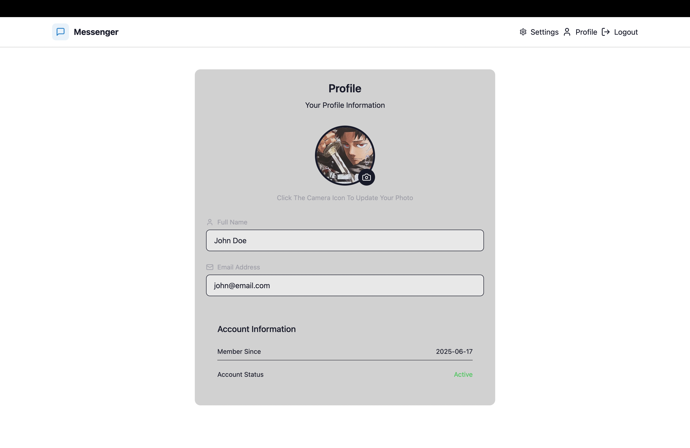

# Messenger App

A full-stack messaging application with basic real-time chat functionality, user authentication (login/signup), and online presence tracking.

## Features

- ✅ User registration and login with JWT-based authentication  
- ✅ Real-time messaging with instant updates  
- ✅ Online users tracking  (displays which users are currently active and available to chat)  
- ✅ Preset themes with switchable UI  
- ⏳ Add specific users via an “Add” button (Coming soon)  
- ⏳ User-editable bios (Coming soon)

## Demo




---

## Getting Started

### Prerequisites

Ensure you have the following installed:

- Node.js (v18+ recommended)
- MongoDB (Atlas or local instance)
- npm

---

## Installation

1. Clone the repository:

```bash
git clone https://github.com/your-username/messenger-app.git
cd messenger-app
```

2. Set up environment variables for both frontend and backend

---

## Running the App Locally

### Frontend

```bash
cd frontend
npm install
npm run dev
```

### Backend

```bash
cd backend
npm install
npm run dev
```

---

## Build Instructions

To build the frontend for production:

```bash
cd frontend
npm run build
```

---

## Project Structure

```
messenger-app/
├── backend/           # Express server, MongoDB models, auth
├── frontend/          # React app with real-time chat UI
└── README.md          # Project documentation
```

---

## Technologies Used

- React + Vite
- TailwindCSS
- Node.js + Express
- MongoDB + Mongoose
- Socket.IO for real-time communication
- JWT for authentication

---